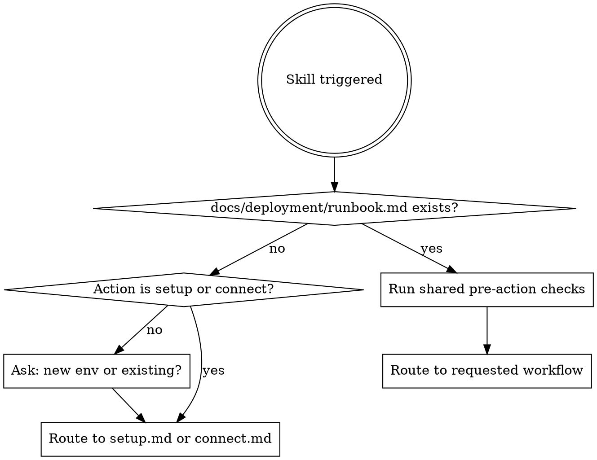

# DevOps

Manage deployments and diagnose production services.

Route `<args>` to the correct workflow:

| Argument pattern | Workflow | Example |
|---|---|---|
| Empty or starts with `deploy` | `workflows/deploy.md` | `/devops` or `/devops deploy` |
| `status` | `workflows/status.md` | `/devops status` |
| `logs` | `workflows/logs.md` (pass optional service name) | `/devops logs api` |
| `rollback` | `workflows/rollback.md` | `/devops rollback` |
| `health` | `workflows/health.md` | `/devops health` |
| Starts with `diagnose` or problem description | `workflows/diagnose.md` (pass symptom as context) | `/devops diagnose 接口超时` |
| `setup` | `workflows/setup.md` | `/devops setup` |
| `connect` | `workflows/connect.md` | `/devops connect` |

Read the matched workflow file and follow it exactly. Pass the relevant portion of `<args>` as context to the workflow.

## Shared: Runbook Resolution

Before executing any workflow, check for the runbook:



## Shared: Pre-Action Checks

Run before every workflow (except setup/connect):

**1. Read the runbook**

```
Read docs/deployment/runbook.md
```

Do not rely on cached/memorized values.

**2. Check for recent infra changes**

```bash
git log --oneline -20 -- infra/ docs/deployment/ .github/workflows/deploy.yml Dockerfile '*/Dockerfile'
```

If there are recent changes to compose files, Dockerfiles, env templates, or deploy scripts:
- Read the changed files
- Determine if the runbook needs updating
- If the changes affect deploy steps (new services, changed ports, new env vars), warn the user before proceeding

**3. Verify runbook accuracy**

Cross-check the runbook against the actual state:
- Compare runbook's service list with the compose file used by the target environment
- Compare runbook's paths with what deploy scripts reference
- If the runbook is wrong or outdated, **update it immediately** before proceeding
- Commit the runbook update as a separate commit so the fix is tracked

## Shared: Environment Selection

The runbook lists all environments in its **Environments** table. Each has its own server, SSH, health URL, and deploy method.

- If the user specifies an environment, use that one
- If not specified, default to **staging**
- For production deploys, always confirm with the user before executing
